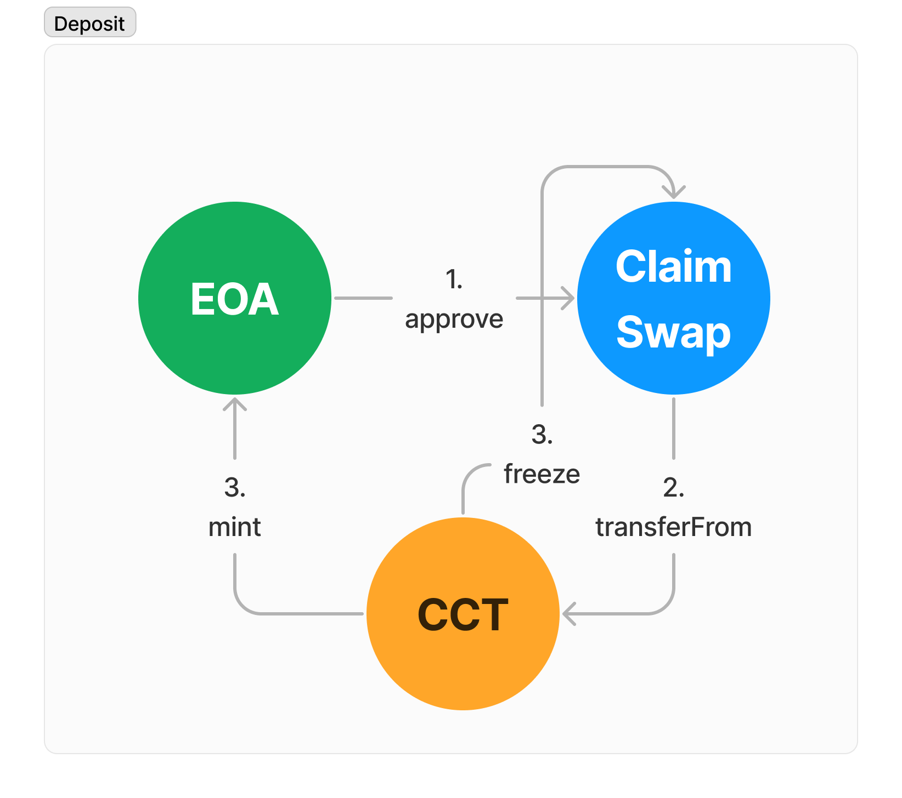
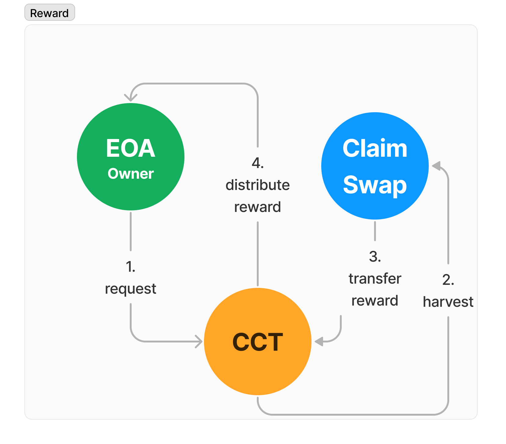
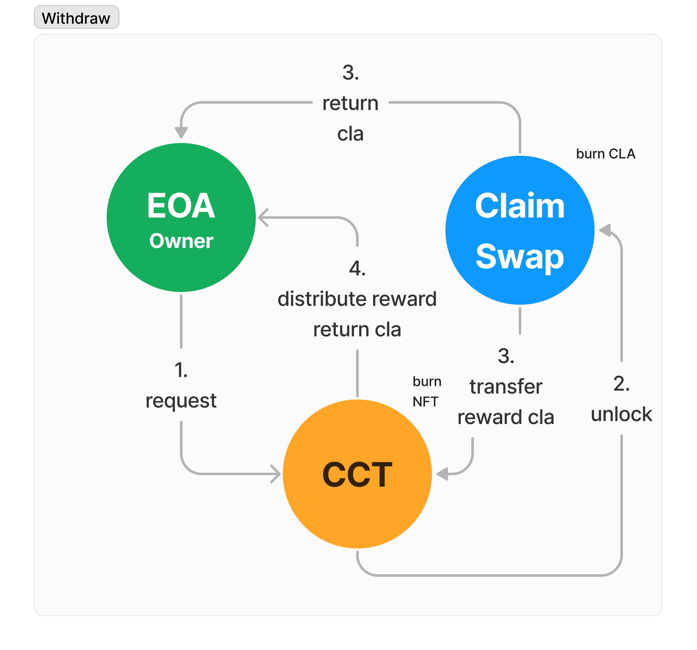

    

# CLA-Convert-NFT

CLA-Convert-NFT(이하 CCT)는 클레이튼 기반의 탈중앙화 거래소 ClaimSwap에서 발행하는 토큰 CLA를 받아 NFT를 발행해주는 서비스입니다.   
CLA는 일괄적으로 180일간 예치할 수 있으며, 실시간으로 쌓여있는 CLA 이자 토큰을 인출할 수 있습니다.   
CCT는, CLA 예치 시 받는 CLS 토큰이 전송이 불가능한 것과 달리 전송이 가능한 NFT입니다. 따라서 예치한 CLA 토큰과 예치 기간 내 쌓인 이자 CLA를 유동화가 가능합니다.

## 서비스 이용 방법

CCT는 크롬 익스텐션인 Kaikas 지갑을 이용해서 사용이 가능합니다. [사이트 이동하기](https://claconvertnft.netlify.app/)

## Project Structure

```
contracts
 ┣ interfaces
 ┃ ┣ IClaContract.sol # ClaimSwap과 상호작용하여 CLA 토큰을 다루는 인터페이스
 ┃ ┣ IClaConvertNFT.sol # CLA-CONVERT-NFT 자체 Contract 메서드의 인터페이스
 ┃ ┣ IClaDistributor.sol # ClaimSwap에 예치한 CLA 토큰에 대한 이자를 다루는 인터페이스
 ┃ ┗ IClsToken.sol # ClaimSwap에 토큰을 예치하고, 보상으로 제공되는 CLS 토큰을 다루는 인터페이스
 ┣ ClaConvertNFT.sol # CLA-CONVERT-NFT 자체 Contract
 ┗ SafeMath.sol # 연산으로 인한 Overflow, Underflow를 방지해주는 Solidity 라이브러리
 ┃
src
 ┣ abi
 ┃ ┣ ClaConvertNFTABI.json # CCT 자체 contract ABI
 ┃ ┗ ERC20ABI.json # ERC20 토큰을 구현한 외부 컨트랙트와 상호작용하는 contract ABI
 ┣ api
 ┃ ┗ UseCaver.js # CaverJS API를 통해 접근할 메서드 정의
 ┣ assets
 ┃ ┣ cct.png # CCT 로고
 ┃ ┣ bg.png # 랜딩페이지 배경 이미지
 ┃ ┗ kaikas.png # 카이카스 지갑 아이콘
 ┣ components # ReactJS 컴포넌트 디렉토리
 ┃ ┣ Intro.js # 지갑 연결 이전 랜딩페이지 컴포넌트
 ┃ ┣ Main.js # 지갑 연결 이후 대시보드 컴포넌트
 ┃ ┗ NFT.js # NFT 단위 컴포넌트
 ┣ constants
 ┃ ┣ constants.baobab.js # 클레이튼 테스트넷 바오밥 관련 상수
 ┃ ┣ constants.cypress.js # 클레이튼 메인넷 사이프레스 관련 상수
 ┃ ┗ index.js # 메인넷과 테스트넷 중 사용할 네트워크를 선택하는 코드
 ┣ App.css # 전체 css
 ┣ App.js # ReactDOM의 root 하부에 Main 컴포넌트와 Intro 컴포넌트 렌더링
 ┣ index.css # body, code 단위 css
 ┗ index.js # ReactDOM을 통한 루트 렌더링
```

## Userflow



## 

## Smart Contract Address

0x5fd363522940860014f1B9C531450e6781F07b99

## Smart Contract Interface

```solidity
pragma solidity ^0.5.0;

interface IClaConvertNFT {
  struct CCT {
    uint256 claAmount;
    uint32 endDay;
  }
  function burn(uint256 tokenId) external;
  function accumulatedRewardCla(uint tokenId) external view returns (uint256 rewardCla);
  function totalAccumulatedRewardCla(address owner) external view returns (uint256 totalRewardCla);
  function claBalanceOf(address account) external view returns (uint256 claBalance);
  function approveCla(uint256 amount) external returns (bool success);
  function convertClaToCct(uint amount) external;
  function claimClaReward(uint256 tokenId, address owner) external;
}
```

## CLA-Convert-NFT Front-End

https://claconvertnft.netlify.app/
